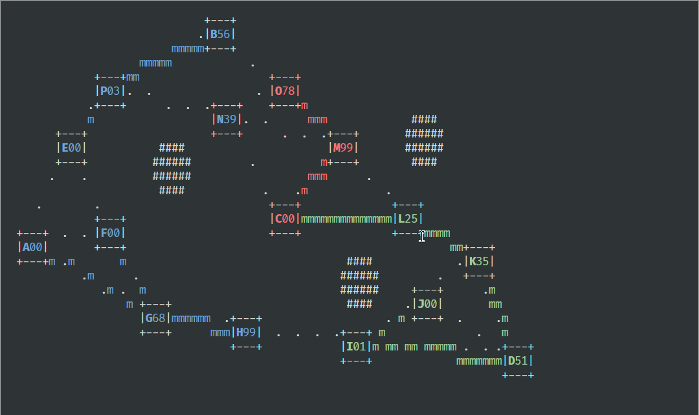

# pins & needles

## Menu

Hráč si v menu může načíst rozehranou hru, nebo si vybere mapu a počet protihráčů. Mapa obsahuje mraveniště, jejich propojení, startovní body kolonií a dekorace.

## Hra

Jakmile se mapa načte, hra poběží v reálném čase (herní čas bude tikat o nějaké frekvenci). Při každém tiku se nejdříve posunou vyslaní mravenci a popř. svedou boj, poté se v ovládaných mraveništích narodí mravenci noví.
Hra končí, když zůstane jen jedna vítězná kolonie nebo se hráč vzdá. Po ukončení se zobrazí obrazovka s výsledky a hráč se bude moct vrátit do menu.

### Kolonie

Každá kolonie začíná na začátku s jedním mraveništěm.
Všechny kolonie kromě hráčovi budou ovládány počítačem. Každá kolonie bude mít svou barvu, hráč bude vždycky modrý.

### Mravenci

Na cestě půjdou mravenci v řadě, při každém tiku se posunou o jednotku a pokud to bude možné / chtěné vyrazí za nimi další.
Pokud se na cestě nebo v mraveništi potkají nepřátelští mravenci navzájem se zabijí.

### Mraveniště

Pokud mraveniště nikdo neovládá nebo v něm došli mravenci, zabere ho první příchozí mravenec.
Ve výchozím stavu budou mravenci zůstávat v mraveništi připraveni na možný útok. Hráč bude moct mravence přesouvat mezi mraveništi tím, že je spojí. Mraveniště může mravence vysílat pouze do jednoho cíle.
Ne všechna mraveniště jsou propojena a cesty nemusí být stejně dlouhé.

### Realizace



### Pohled

Mraveniště budou označena písmeny a barvou ovládající kolonie (šedá pokud nejsou obsazena). Vedle označení bude počet bránících mravenců.
Barvu příslušející kolonie budou používat i zobrazení mravenci na cestě.
Mezi mraveništi povedou přerušované čáry indikující možný přesun.
Dekorace na mapě mohou být např. zdi (zde `#`), voda, stromy atp..

### Ovládání

Hráč bude hru ovládat jednoduchými příkazy tvaru `XY` + ENTER.

- `X` písmeno zdroje přesunu
- `Y` písmeno cíle

Příkaz s pouze jedním písmenem bude znamenat zrušení přesunu z mraveniště.
Neplaté příkazy budou ignorovány.

Pomocí ';' si hráč hru pozastaví a bude mít možnost ji uložit nebo se vzdát.

### Uložení

Hra půjde v průběhu uložit do souboru a následně v menu načíst. Název souboru bude mapa + aktuální čas.
Program bude pro mapy využívat složku assets a uložené hry složku examples. Uložené hry a mapy budou odlišeny příponou.
V souboru bude seznam `GameObject`ů a se stavem hry (`GameObject`y mají metodu `serialize`). Formát mapy a uložené hry se lišit nebude, mapa bude jen výchozí stav hry.

### Polymorfismus

Polymorfismu budou využívat herní objekty pro vykreslování, updatování při tiku a dalších eventech. `GameObject`y jako `Ant`, `AntNest`, `Player` atd. budou uchovávány v objektu `Game`, který bude zajištovat dění ve hře. V každé fázi herního cyklu bude volat virtuální metody na `GameObject`ech.
Zaroveň bude polymorfismu využito při ukládání hry pro serializaci `GameObject`ů.

---

# Zadání semestrální práce z Progtestu

## Ant wars

Naprogramujte jendoduchou hru války několika mravenčích klanů. Mravenci se rodí v mraveništích a lze jim zadat cíl - jiné mraveniště.

Na cizí mraveniště mravenci útočí, vlastní opevňují.

Váš engine:

1. ze souboru nahraje mapu s lokacemi mraveništ a překážek
2. implementuje triviální interakci mravenec vs. mravenec (např. jeden zabije jednoho)
3. implementuje jednoduchou škálovanou AI řídící organizaci klanů mravenců
4. umožňuje ukládat a načítat rozehrané hry

Engine může fungovat real-time hra, či tahová hra.

Jak může vypadat mapa?

- " " - prázdné místa pro pohyb mravenců
- A a B (resp Z,Y,X a W pro druhého hráče) označují mraveniště s daným počtem mravenců uvnitř
- a,b (resp z,y,x,w) označují jednotlivé mravence
- zadané cesty lze označit (v ukázce A->B, B->Y, Y->B, W->Y, X->Y, Z->Y, např. z mraveniště Z vyrazilo 5 mravenců a dalších 6 ještě vyjde po zadané cestě

```plaintext
##################################################
#                                                #
#                                                #
#     █████           █████                      #
#     █A13█aaaaaaaaaaa█B20█                      #
#     █████           █████                      #
#                          b                     #
#                          b                     #
#                           b                    #
#########################   b              █████ #
#                            b             █W03█ #
#                            y             █████ #
#                             y         -ww      #
#                             y     <---         #
#       █████                  █████       █████ #
#       █Z06█zzzzz------------>█Y30█<-xx--x█X01█ #
#       █████                  █████       █████ #
#                                                #
##################################################
```

Kde lze využít polymorfismus? (doporučené)

- Parametry útočníků: znak, barva, písmeno, ...
- Políčka mapy: volno, věž, mravenec...
- Uživatelské rozhraní: konzole, ncurses, SDL, OpenGL (různé varianty), ...

Při implementaci se pokuste implementovat nějaké vlastní zajímavé prvky.
